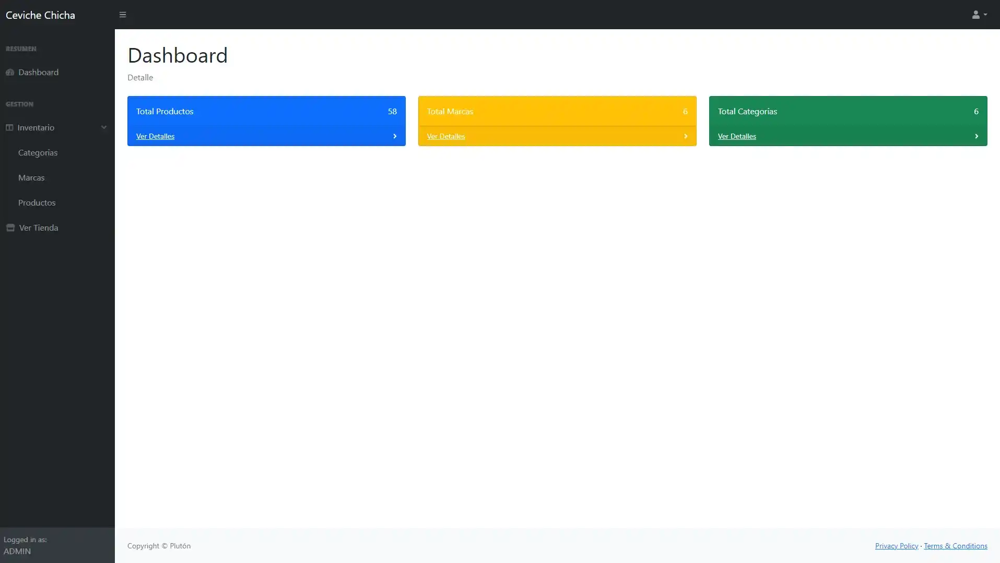
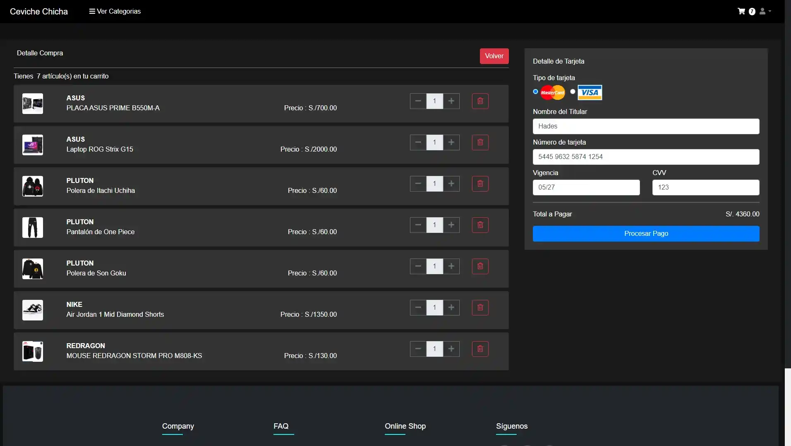
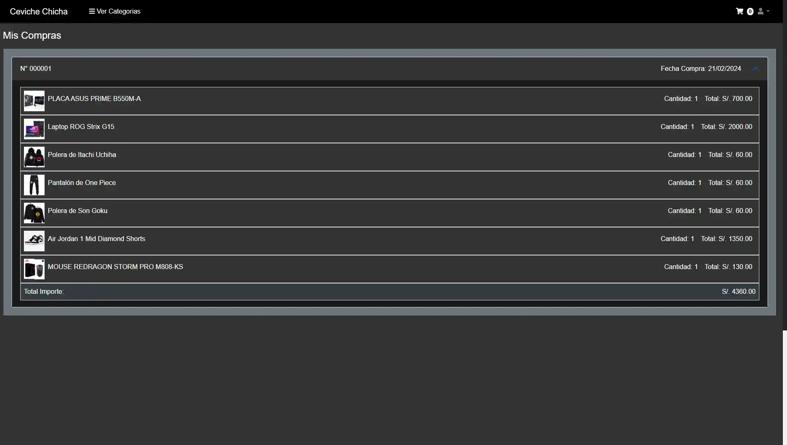

# Inventario.Net

**Inventario.Net**! es una plataforma web diseñada para gestionar productos, compras y usuarios en un sistema de inventario en línea. El sistema permite administrar categorías, marcas y productos, facilitando la compra de productos a los usuarios. La plataforma tiene un diseño responsivo, con una interfaz intuitiva tanto para usuarios comunes como para administradores.

## Índice

- [Descripción del Proyecto](#descripción-del-proyecto)
- [Tecnologías Utilizadas](#tecnologías-utilizadas)
- [Caracteristicas](#caracteristicas)
- [Estructura del Proyecto](#estructura-del-proyecto)
- [Funcionalidades](#funcionalidades)
- [Uso](#uso)
- [Contribuyentes](#contribuyentes)
- [Licencia](#licencia)
- [Imágenes y Videos](#imágenes-y-videos)

## Descripción del Proyecto

**Inventario.Net** es un sistema basado en la web que permite gestionar productos, categorías, marcas, compras y más, en un inventario organizado. Está orientado a usuarios que deseen realizar compras en línea y administradores que gestionan la base de datos de productos. El sistema permite administrar y actualizar los productos, generar compras, y administrar la información de los usuarios.

## Tecnologías Utilizadas

Este proyecto utiliza las siguientes tecnologías y herramientas:

- **ASP.NET MVC:** Framework para la creación de aplicaciones web dinámicas.

- **C#:** Lenguaje de programación principal.

- **SQL Server:** Sistema de gestión de bases de datos utilizado para almacenar la información.

- **HTML5 y CSS3:** Para la estructura y el diseño visual de la página.

- **JavaScript/jQuery:** Para la interactividad del sitio.

- **SweetAlert:** Librería para mostrar alertas personalizadas.

- **Popper.js::** Utilizado para la creación de componentes emergentes y despliegues.

## Caracteristicas

Este proyecto incluye las siguientes características:

- **Gestión de Productos:** Los administradores pueden agregar, editar y eliminar productos del inventario.

- **Carrito de Compras:** Los usuarios pueden agregar productos al carrito y proceder con la compra.

- **Autenticación de Usuarios:** Sistema de login y registro para acceder a las funcionalidades personalizadas.

- **Vista de Tienda:** Una página donde los productos se muestran en una interfaz accesible para el usuario.

- **Alertas Dinámicas:** Utilización de SweetAlert para mostrar mensajes interactivos y de confirmación.

## Estructura del Proyecto

La estructura del proyecto incluye los siguientes directorios principales:

```
└── 📁Inventario.Net
    └── 📁Inventario
        └── 📁.vs
            └── ProyectoTest.csproj.dtbcache.json
        └── 📁App_Start
            └── BundleConfig.cs
            └── FilterConfig.cs
            └── RouteConfig.cs
        └── 📁Controllers
            └── HomeController.cs
            └── LoginController.cs
            └── TiendaController.cs
        └── favicon.ico
        └── Global.asax
        └── Global.asax.cs
        └── 📁Imagenes
            └── 📁Productos
                └── 01.jpg
                └── 02.jpg
                └── 03.jpg
                └── 04.jpg
            └── 📁Tarjetas
                └── master.png
                └── visa.png
        └── Inventario.csproj
        └── Inventario.csproj.user
        └── 📁Logica
            └── CarritoLogica.cs
            └── CategoriaLogica.cs
            └── CompraLogica.cs
            └── Conexion.cs
            └── MarcaLogica.cs
            └── ProductoLogica.cs
            └── UbigeoLogica.cs
            └── UsuarioLogica.cs
            └── utilidades.cs
        └── 📁Models
            └── Carrito.cs
            └── Categoria.cs
            └── Compra.cs
            └── DEPARTAMENTO.cs
            └── DetalleCompra.cs
            └── Distrito.cs
            └── Marca.cs
            └── Producto.cs
            └── Provincia.cs
            └── Usuario.cs
        └── 📁Views
            └── _ViewStart.cshtml
            └── 📁Home
                └── Categoria.cshtml
                └── Index.cshtml
                └── Marca.cshtml
                └── Producto.cshtml
                └── Tienda.cshtml
            └── 📁Login
                └── Index.cshtml
                └── Registrarse.cshtml
            └── 📁Shared
                └── _Layout_Tienda.cshtml
                └── _Layout.cshtml
                └── Error.cshtml
            └── 📁Tienda
                └── Carrito.cshtml
                └── Compras.cshtml
                └── Index.cshtml
                └── Producto.cshtml
            └── Web.config
    └── 📁Utilidad
        └── 📁bin
            └── 📁Debug
                └── Utilidad.dll
                └── Utilidad.pdb
        └── 📁obj
            └── 📁Debug
                └── .NETFramework,Version=v4.5.AssemblyAttributes.cs
        └── 📁SQL Server
            └── 001_CREACION BASE Y TABLAS.sql
            └── 002_PROCEDIMIENTOS.sql
            └── 003_INSERTAR DATOS.sql
        └── Utilidad.csproj
    └── Inventario.sln
    └── README.md
```

## Funcionalidades

### 1. Gestión de Productos

Los administradores pueden agregar, editar o eliminar productos del sistema a través de las vistas correspondientes. Los productos están categorizados y organizados por marca.

### 2. Carrito de Compras:

Los usuarios pueden agregar productos al carrito y proceder con su compra. El sistema calcula el total y gestiona las compras correctamente.

### 3. Autenticación de Usuarios

El sistema permite a los usuarios registrarse e iniciar sesión para realizar compras, almacenar productos en el carrito y hacer un seguimiento de sus compras anteriores.

### 4. Interacción con la Tienda

Los usuarios pueden explorar los productos disponibles, ver detalles, y agregar productos a su carrito. Los productos están organizados por categoría y marca.

### 5. Base de Datos SQL

El sistema utiliza SQL Server para almacenar la información de productos, compras, categorías, marcas y usuarios.

## Uso

### 1. Instalación

Para instalar el proyecto en tu máquina local:

```bash
git clone https://github.com/Hades0413/Inventario.Net.git
cd Inventario.Net
open Inventario.sln

```

Abre el archivo .sln en Visual Studio y ejecuta el proyecto.

### 2. Personalización

Puedes personalizar el contenido del sitio modificando los siguientes archivos:

```bash
Imágenes: Las imágenes de productos se encuentran en Inventario/Imagenes/Productos/.
```

```bash
Archivos de Estilos: El archivo principal de estilos está en Inventario/css/estilos.css.

```

```bash
Archivos de Lógica: Las lógicas de negocio se encuentran en Inventario/Logica/.

```

### 3. Base de Datos

Asegúrate de ejecutar los scripts SQL disponibles en el directorio Utilidad/SQL Server/ para crear las tablas y procedimientos necesarios.

## Contribuyentes

```bash
Eduardo Miguel Jaime Gomero (Hades0413)
```

## Licencia

Este proyecto está bajo la Licencia MIT. Puedes usar, modificar y distribuir el código con fines personales o comerciales.

## Imágenes y Videos

### Imágenes:

A continuación, se muestran algunas imágenes del formulario de autenticación (AuthForm) y otras vistas relevantes:

1. 
2. 
3. 
4. 

Videos:
Demo del Proyecto:
Cómo ejecutar el Proyecto:

```

```
